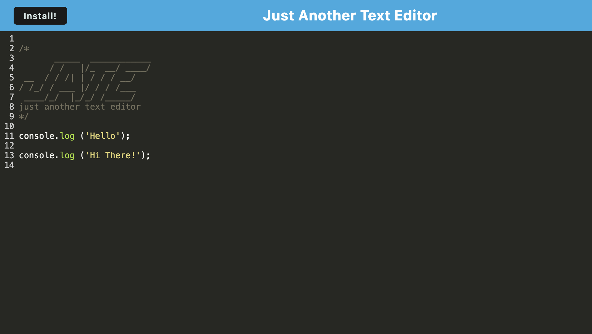
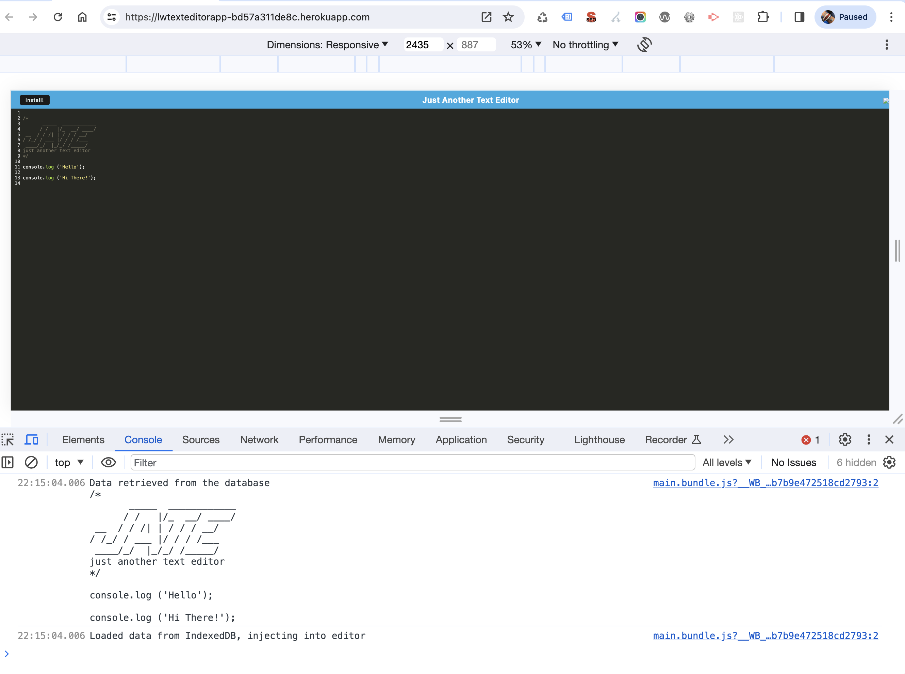

# text-editor
Bootcamp Module 19: Progressive Web Applications (PWA) Challenge - Text Editor

## Progressive Web Applications (PWA) Challenge: Text Editor
In this project, we were asked to build a text editor that runs in the browser. The app is a single-page application that meets the PWA criteria and it features a number of data persistence techniques that serve as redundancy in case one of the options is not supported by the browser. The application also functions offline.

This is a class project so we are submitting the same code.

## URLs Submitted:

* URL of the functional, deployed application on Heroku: https://lwtexteditorapp-bd57a311de8c.herokuapp.com/ 

* My GitHub Repo URL: https://github.com/lenzlee/text-editor 

## References and Resources: 

Code was provided by our cohort instructors and TAs.

## Screenshots:

* Screenshot 1

* Screenshot 2

## Contact Me
Lenzlee Wheeler at: https://github.com/lenzlee 